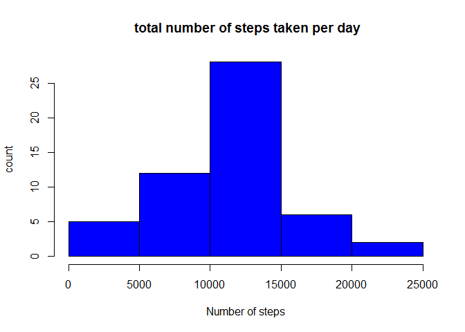
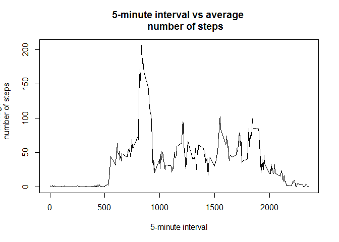
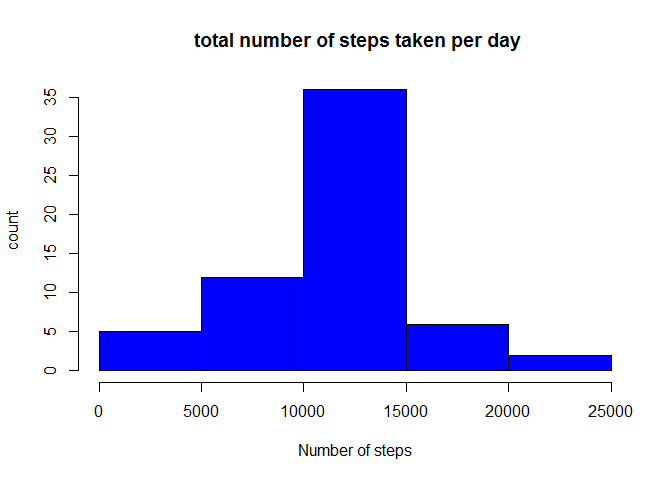
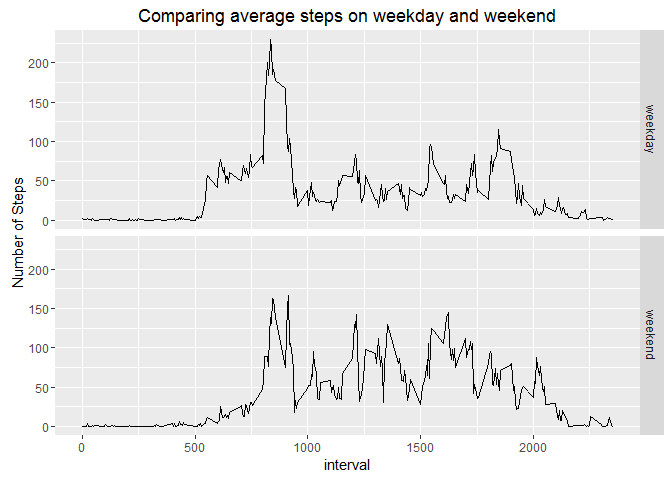

# Reproducible Research: Peer Assessment 1


```r
knitr::opts_chunk$set(echo = TRUE)
```
# Reading and processing the data
 1. Reading the data into R
 2. Removing not available data


```r
act <- read.csv("activity.csv", stringsAsFactors = FALSE, na.strings = "NA")
act$date <- as.Date(act$date, format = "%Y-%m-%d")
act1 <- na.omit(act)
```

# What is mean total number of steps taken per day?
  1. Calculating the total number of steps per day
  2. Ploting a histogram of the the total number of steps taken


```r
stepsnum <- tapply(act1$steps, act1$date, sum)
stepsnum <- as.data.frame.table(stepsnum)
colnames(stepsnum) <- c("date","total steps per day")
stepsnum$date <- as.Date(stepsnum$date, format = "%Y-%m-%d")
hist(stepsnum[,2], col= "blue", main = " total number of steps taken per day", 
    xlab = "Number of steps", ylab = "count")
```

<!-- -->

  3. Calculating mean and median of the total number of steps taken per day


```r
mean1 <- mean(stepsnum[,2])
median1 <- median(stepsnum[,2])
```

The mean total number of steps per day is 1.0766189\times 10^{4} and the median is 10765

# What is the average daily activity pattern?
  1. Make a time series plotof the 5-minute interval (x-axis) and the average number       of steps taken, average across all days (y-axis)


```r
InAve <-  aggregate(steps ~ interval, act1, mean)
plot(InAve$interval,InAve$steps, type = "l", main = "5-minute interval vs average 
     number of steps", xlab = "5-minute interval", ylab = "average 
     number of steps")
```

<!-- -->

  2. Getting the maximum 5 minute interval contains the highest number of steps on          average across across all the days
  

```r
highest <- InAve[which.max(InAve$steps),1]
```

The maximum 5 minute interval contains the highest number of steps on          average across across all the days is 835 interval

# Imputing missing values

Note that there are a number of days/intervals where there are missing values (coded as NA). The presence of missing days may introduce bias into some calculations or summaries of the data.

  1. Calculate and report the total number of missing values in the dataset


```r
NumNa <- sum(is.na(act$steps))
```

The number of missing value ("NA") is 2304

  2. The missing data is replace with the mean value of each 5 minute interval             respectively and a new dataset is created
  

```r
NoData <- act[is.na(act$steps),]
RData <- merge(NoData,InAve,by = "interval")
RData$steps.x <- NULL
colnames(RData) <- c("interval","date","steps")
act2 <- rbind(act1,RData)
act2 <- act2[with(act2,order(date)),]
```

  3. Ploting a histogram of the the total number of steps taken with the new dataset
  

```r
stepsnum1 <- tapply(act2$steps, act2$date, sum)
stepsnum1 <- as.data.frame.table(stepsnum1)
colnames(stepsnum1) <- c("date","total steps per day")
stepsnum1$date <- as.Date(stepsnum1$date, format = "%Y-%m-%d")
hist(stepsnum1[,2], col= "blue", main = " total number of steps taken per day", 
     xlab = "Number of steps", ylab = "count")
```

<!-- -->

  4. Calculating mean and median of the total number of steps taken per day with the       new dataset
  

```r
mean2 <- mean(stepsnum1[,2])
median2 <- median(stepsnum1[,2])
```

The new mean total number of steps per day is 1.0766189\times 10^{4} and the new median is 1.0766189\times 10^{4}. After imputing the missing data, the mean remains unchanged while the slight change in the median. Imputting missing data with the mean value steps taken in each 5 minute interval has no impact to the mean value while causing slight change in the median.

# Are there differences in activity patterns between weekdays and weekends?

  1. Create a new factor variable in the dataset with two levels - "weekday" and           "weekend" indicating whether a given date is a weekday or weekend day
  

```r
day <- weekdays(act2$date)
day <- sub("Monday", "weekday", day)
day <- sub("Tuesday", "weekday", day)
day <- sub("Wednesday", "weekday", day)
day <- sub("Thursday", "weekday", day)
day <- sub("Friday", "weekday", day)
day <- sub("Saturday", "weekend", day)
day <- sub("Sunday", "weekend", day)
act3 <- cbind(act2,day)
```
  2. Make a panel plot containing a time series plot of the 5-minute interval (x-axis)      and the average number of steps taken, averaged across all weekday days or            weekend days (y-axis)

```r
library(ggplot2)
ComDay <- aggregate(steps ~ interval + day, act3, mean)
g <- ggplot(ComDay,aes(interval,steps))
g + geom_line() + facet_grid(day~.) + labs(title ="Comparing average steps on weekday and weekend") + ylab("Number of Steps")
```

<!-- -->

It is noticed that the number of steps are pick up in the ealier hours on the weekday as compare to the weekend.
